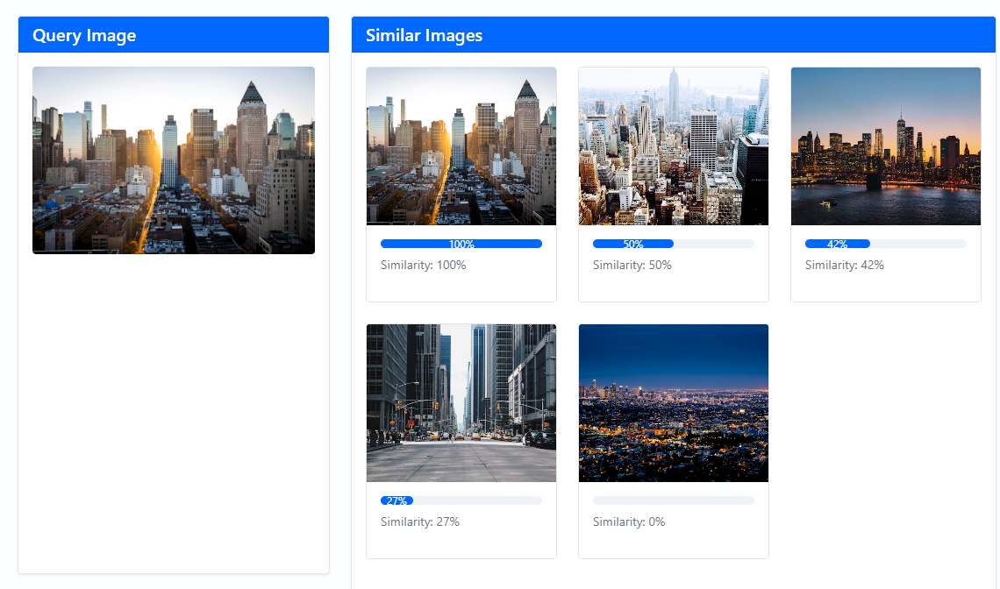

# InspireSearch: AI-Powered Visual Search Engine


> **Project Description**: InspireSearch is an AI-powered visual search engine that uses ResNet50 for feature extraction and Faiss for similarity search. Upload any image to instantly find visually similar content from your dataset. This project showcases expertise in deep learning, computer vision, and web development while demonstrating practical implementation of vector similarity search in a production-ready Flask application.



## Key Features

- **Visual Similarity Search**: Upload any image and discover visually similar content using AI
- **Deep Learning Integration**: Utilizes ResNet50 architecture to extract high-dimensional feature vectors
- **High-Performance Vector Search**: Implements Facebook AI's Faiss library for efficient similarity computation
- **Responsive Web Interface**: Clean, modern UI with drag-and-drop functionality
- **Real-time Processing**: Instantly displays results with accurate similarity percentages

## Technology Stack

### Machine Learning & Computer Vision
- **Feature Extraction**: ResNet50 convolutional neural network pre-trained on ImageNet
- **Vector Similarity**: Faiss (Facebook AI Similarity Search) for efficient nearest neighbor search
- **Image Processing**: TensorFlow and Pillow for image manipulation and preprocessing

### Web Development
- **Backend**: Flask web framework with Jinja2 templating
- **Frontend**: Bootstrap 5, JavaScript, HTML5/CSS3
- **Responsive Design**: Mobile-friendly interface with modern UI components

### DevOps & Deployment
- **Environment Management**: Conda for dependency isolation and reproducibility
- **Containerization-Ready**: Structured for easy Docker deployment
- **Cloud-Compatible**: Designed for AWS Free Tier deployment (EC2/Elastic Beanstalk)

## Installation

> **Note for Windows Users**: Faiss installation can be challenging on Windows. We recommend using Conda for the most reliable installation: `conda install -c conda-forge faiss-cpu`

### Option 1: Using Conda (Recommended)

```bash
# Clone the repository
git clone https://github.com/CodeQueenie/InspireSearch.git
cd InspireSearch

# Create and activate the conda environment
conda env create -f environment.yml
conda activate inspiresearch

# Download sample images
python download_sample_images.py

# Run the application
python app.py
```

### Option 2: Using pip

```bash
# Clone the repository
git clone https://github.com/CodeQueenie/InspireSearch.git
cd InspireSearch

# Create and activate a virtual environment
python -m venv venv
source venv/bin/activate  # On Windows: venv\Scripts\activate

# Install dependencies
pip install -r requirements.txt

# Download sample images
python download_sample_images.py

# Run the application
python app.py
```

## Usage

1. **Start the application** and navigate to `http://127.0.0.1:5000/` in your browser
2. **Upload an image** by dragging and dropping or using the file browser
3. **View results** showing the top 5 most similar images with similarity percentages
4. **Explore the dataset** by using different query images

## Architecture

InspireSearch follows a three-stage pipeline:

1. **Feature Extraction**: When an image is uploaded, it's processed through ResNet50 to generate a 2048-dimensional feature vector representing its visual characteristics.

2. **Similarity Computation**: The extracted feature vector is compared against pre-computed vectors from the dataset using Euclidean distance calculations accelerated by Faiss.

3. **Result Ranking**: Images are ranked by similarity score and presented to the user with visual indicators of match quality.

## Deployment Options

### AWS Elastic Beanstalk
Perfect for quick deployment with minimal configuration:

```bash
# Install EB CLI
pip install awsebcli

# Initialize EB application
eb init -p python-3.8 inspiresearch

# Create an environment and deploy
eb create inspiresearch-env
```

### AWS EC2
For more customization and control:

1. Launch an EC2 instance with Amazon Linux 2
2. Install dependencies: `sudo yum install git python3 python3-pip`
3. Clone the repository and follow the installation steps
4. Configure Nginx/Apache as a reverse proxy

## Project Structure

```
InspireSearch/
├── app/                    # Application package
│   ├── __init__.py         # Package initializer
│   ├── image_search.py     # Core image search functionality
│   └── utils.py            # Utility functions
├── static/                 # Static assets
│   ├── css/                # CSS stylesheets
│   ├── dataset/            # Sample image dataset
│   ├── img/                # UI images
│   ├── index/              # Faiss index files
│   ├── js/                 # JavaScript files
│   └── uploads/            # User uploaded images
├── templates/              # HTML templates
│   ├── about.html          # About page
│   ├── base.html           # Base template
│   ├── index.html          # Home page
│   └── results.html        # Search results page
├── app.py                  # Main application entry point
├── download_sample_images.py  # Script to download sample images
├── environment.yml         # Conda environment specification
└── requirements.txt        # Pip dependencies
```

## Technical Challenges Solved

- **Efficient Similarity Search**: Implemented Faiss to handle high-dimensional vector search efficiently, allowing for sub-second query times even with large datasets.
  
- **Cross-Platform Compatibility**: Resolved Windows-specific issues with Faiss by implementing a conda-based installation approach.

- **Responsive UI**: Created a modern, responsive interface with real-time feedback during image processing.

- **Normalized Similarity Scores**: Developed a robust algorithm to convert Euclidean distances to intuitive similarity percentages.

## License

This project is licensed under the MIT License - see the LICENSE file for details.

## Attribution Requirements

When using or adapting this project, please provide attribution to Nicole LeGuern and link back to the original repository.

## Acknowledgements

- [TensorFlow](https://www.tensorflow.org/) for the deep learning framework
- [Faiss](https://github.com/facebookresearch/faiss) for efficient similarity search
- [Flask](https://flask.palletsprojects.com/) for the web framework
- [Bootstrap](https://getbootstrap.com/) for the frontend components
- [Unsplash](https://unsplash.com/) for sample images
